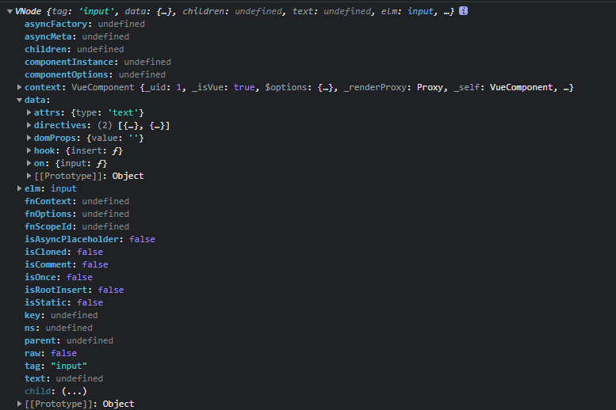

# VNode（虚拟DOM）
## 定义
虚拟DOM其实是以一颗js对象（VNode节点）作为基础的树，用对象的属性来描述节点，实际上它只是一层对真实DOM的抽象表示。
## 作用
虚拟DOM的目的是使用虚拟节点代替真实节点，所有的操作都发生在虚拟节点，通过diff算法对比新旧两颗虚拟DOM树，计算出更新后真实DOM的最少操作，由框架代替用户执行这些操作，让用户可以把大量精力放在业务逻辑上

## Vue的VNode


```
  elm: 当前虚拟节点对应的真实dom节点
  data: 当前节点的对应的有些信息数据，是一个VNodeData类型的数据(对应vue的语法操作DOM的信息)
  content: 当前节点的编译作用域（可以当前的vue的作用域）
  text: 当前节点的文本
  key: 节点的key属性，被当作节点的标志，用以优化
  tag: 当前节点的标签名
  raw: 是否为原生HTML或只是普通文本，innerHTML的时候为true，textContent的时候为false
  parent: 当前节点的父节点
  ns: 当前节点的命名空间
  children: 当前节点的子节点，是一个数组
  isStatic: 静态节点标志 keep-alive
  isRootInsert: 是否作为根节点插入
  isCloned: 是否为克隆节点
  isComment: 是否作为注释节点
  isOnce: 是否有v-once指令
  componentInstance: 当前节点对应的组件的实例
  componentOptions: 组件的option选项
  fnContext: 函数化组件作用域上下文
  fnOptions: 函数化组件配置项
  fnScopeId: 函数化组件ScopeId
  asyncFactory: 异步工厂方法
  asyncMeta: 异步Meta
  isAsyncPlaceholder: 是否为异步占位符
```

